<!-- BANNER -->

  

# 🚀 Awesome Pub/Sub Messaging & Push Notifications Ecosystem

  
  
  
  
  
  

---

## 📌 Executive Overview & Ecosystem Guide

Welcome to the definitive **curated ecosystem guide for Pub/Sub messaging, push notification services, and self-hosted real-time infrastructure**. 

Whether you are building high-throughput microservice event buses, developer-facing multi-channel notification centers (email, SMS, web/mobile push, Slack, Discord), or edge MQTT brokers for IoT, this repository provides verified specs, pricing tiers, free quotas, and open-source star metrics.

---

## 💡 Table of Contents
- [🏢 SaaS & Hosted Platforms](#-saas--hosted-platforms)
- [⚡ Open-Source GitHub Projects (Sorted by Stars)](#-open-source-github-projects-sorted-by-stars)
  - [🔔 Notification Infrastructure & Workflow Engines](#-notification-infrastructure--workflow-engines)
  - [📡 Real-Time Pub/Sub & Event Brokers](#-real-time-pubsub--event-brokers)
  - [📲 Push Notification Gateways & Libraries](#-push-notification-gateways--libraries)
  - [🌐 MQTT & IoT Messaging Brokers](#-mqtt--iot-messaging-brokers)
- [🤝 How to Contribute](#-how-to-contribute)
- [⚠️ Compliance & Security Disclaimer](#-compliance--security-disclaimer)
- [📈 Star History](#-star-history)
- [💖 Support & Sponsorship](#-support--sponsorship)

---

## 🏢 SaaS & Hosted Platforms

The global push notification services & real-time messaging market is estimated at **$4.0B - $20B+** (projected to reach $12B - $90B+ over the next decade) and is **moderately fragmented**: underlying mobile push/messaging networks are highly concentrated around cloud giants (AWS, Google), while higher-level workflow orchestration, engagement, and omnichannel notification APIs remain a competitive, fragmented space.

| Product | Description | Starting Pricing | Free Tier / Trial Limit | Valuation / Revenue |
| :--- | :--- | :--- | :--- | :--- |
| **[Amazon SNS](https://aws.amazon.com/sns/)** | AWS's pub/sub messaging service for SMS, email, SQS, and Lambda delivery. Best for AWS-native pub/sub. | $0.50 per 1M publishes | 1M publishes, 1M mobile push, and 1,000 email deliveries per month free forever | **$128.7B+ ARR** (AWS revenue; Parent Amazon $1.7T+ Market Cap) |
| **[Firebase Cloud Messaging](https://firebase.google.com/products/cloud-messaging)** | Google's push notification service for mobile and web. Best for Firebase ecosystem. | $0.00 / free (FCM service) | 100% free with unlimited messages & MAUs (pay only for dependent Google Cloud services) | **$70B+ ARR** (Google Cloud revenue; Parent Alphabet $4.2T Market Cap) |
| **[Twilio](https://www.twilio.com/)** | Communication APIs for SMS, voice, email, and push notifications. Best for omnichannel communication. | $0.0083/SMS segment, $0.014/min voice | 30-day free trial with ~100 SMS / 75 mins voice to verified numbers (no credit card required) | **$4.2B - $5.1B ARR** ($44B+ Market Cap) |
| **[Braze](https://www.braze.com/)** | Customer engagement platform for cross-channel messaging and analytics. Best for enterprise marketing. | ~$60,000/year base contract | 14-day free trial available (no permanent free tier) | **$600M+ ARR** ($3.5B+ Market Cap) |
| **[Airship](https://www.airship.com/)** | Customer engagement platform for push, in-app, SMS, and email. Best for enterprise engagement. | ~$25,000/year base contract | Sales-assisted proof-of-concept / pilot program only (no public free tier or self-serve trial) | **$200M+ ARR** ($300M+ Private Valuation) |
| **[Courier](https://www.courier.com/)** | Notification infrastructure API to route messages across email, SMS, push, and chat. Best for multi-channel notifications. | $0.005 per send (Business plan) | 10,000 sends per month free forever | **$89M - $118M ARR** ($47M total VC funding) |
| **[OneSignal](https://onesignal.com/)** | Leading push notification platform for mobile, web, and email. Best for mobile engagement. | $19/month (Growth plan) | 1,000 mobile MAUs, 10,000 web subscribers, and 10,000 email sends per month free forever | **$21.6M ARR** ($84M total VC funding) |
| **[Knock](https://knock.app/)** | Notification infrastructure with workflow builder and subscriber preferences. Best for developer-friendly notifications. | $250/month (Starter plan) | 10,000 notification sends per month free forever | **~$10M ARR** ($18M total VC funding) |
| **[Novu](https://novu.co/)** | Open-source notification infrastructure platform (Cloud hosted option). Best for developer notification engines. | $30/month (Pro plan) | 10,000 workflow runs per month free forever | **~$5M ARR** ($6.6M total VC funding) |
| **[Pusher](https://pusher.com/)** | Real-time pub/sub messaging via WebSocket channels. Best for real-time features. | $49/month (Startup plan) | 200,000 messages/day and 100 concurrent connections free forever | **$1.5M - $5M ARR** ($35M acquisition by MessageBird) |

---

## ⚡ Open-Source GitHub Projects (Sorted by Stars)

All open-source repositories below are sorted in **descending order by GitHub_Stars_Count**. Each project includes a white social Stars_Badge linking directly to its GitHub stargazers page.

### 🔔 Notification Infrastructure & Workflow Engines

- **[Novu](https://github.com/novuhq/novu)**   
  **The leading open-source notification infrastructure platform**, MIT licensed with **35,000+ GitHub_Stars**. Provides a unified API for email, SMS, push, in-app inbox, Slack, Teams, Discord, and WhatsApp. Features drag-and-drop visual workflow editors, embeddable React/Angular/Vue inbox components, and subscriber preference management.

- **[ntfy](https://github.com/binwiederhier/ntfy)**   
  **HTTP-based pub/sub notification service**, Apache-2.0/GPL-2.0 licensed with **20,000+ GitHub_Stars**. Allows sending notifications to desktop or mobile via simple HTTP PUT/POST requests. Excellent for self-hosted scripts, home automation, and devops alerts.

- **[Apprise](https://github.com/caronc/apprise)**   
  **Push notification library for 100+ services**, MIT licensed with **12,000+ GitHub_Stars**. Provides a lightweight CLI and Python library to send alerts across Telegram, Discord, Slack, email, SMS, and dozens of custom push services.

- **[Gotify](https://github.com/gotify/server)**   
  **Self-hosted push notification server**, MIT licensed with **10,000+ GitHub_Stars**. Real-time REST API server for sending and receiving messages with web UI and Android app integration.

- **[Uniqush-Push](https://github.com/uniqush/uniqush-push)**   
  **Unified push service system**, Apache-2.0 licensed with **1,400+ GitHub_Stars**. Standalone push gateway service for server-side notifications to mobile devices across FCM, APNs, and ADM.

- **[Notifuse](https://github.com/Notifuse/notifuse)**   
  **Open-source notification engine**, AGPL-3.0 licensed. Multi-tenant notification routing layer for transactional messaging.

---

### 📡 Real-Time Pub/Sub & Event Brokers

- **[Redis](https://github.com/redis/redis)**   
  **In-memory data structure store & Pub/Sub engine**, BSD-3-Clause licensed with **65,000+ GitHub_Stars**. Simple channel-based message fan-out and stream processing backbone.

- **[Apache Kafka](https://github.com/apache/kafka)**   
  **Distributed event streaming platform**, Apache-2.0 licensed with **28,000+ GitHub_Stars**. Ultra-high-throughput pub/sub log architecture with fault-tolerant persistent storage.

- **[Apache Pulsar](https://github.com/apache/pulsar)**   
  **Distributed messaging & streaming platform**, Apache-2.0 licensed with **14,000+ GitHub_Stars**. Multi-tenant pub/sub with serverless functions, geo-replication, and tiered storage.

- **[RabbitMQ](https://github.com/rabbitmq/rabbitmq-server)**   
  **Reliable message broker**, MPL-2.0 licensed with **12,000+ GitHub_Stars**. Supports AMQP, MQTT, and STOMP protocols with flexible routing exchanges and pub/sub topologies.

- **[Centrifugo](https://github.com/centrifugal/centrifugo)**   
  **Scalable real-time messaging server**, Apache-2.0 licensed with **8,000+ GitHub_Stars**. WebSocket, SSE, and gRPC pub/sub engine with connection presence and message history.

- **[NATS Server](https://github.com/nats-io/nats-server)**   
  **Cloud-native pub/sub system**, Apache-2.0 licensed with **15,000+ GitHub_Stars**. Ultra-lightweight, high-performance pub/sub messaging engine with JetStream persistence.

- **[Mercure](https://github.com/dunglas/mercure)**   
  **Server-Sent Events (SSE) pub/sub protocol & hub**, AGPL-3.0 licensed with **3,500+ GitHub_Stars**. Designed for pushing real-time updates directly to web browsers without WebSockets.

---

### 📲 Push Notification Gateways & Libraries

- **[web-push](https://github.com/web-push-libs/web-push)**   
  **Web Push library for Node.js**, MIT licensed with **3,000+ GitHub_Stars**. Standard W3C Web Push protocol implementation supporting VAPID encryption for browser push.

- **[pywebpush](https://github.com/web-push-libs/pywebpush)**   
  **Web Push library for Python**, MPL-2.0 licensed with **800+ GitHub_Stars**. Python implementation of WebPush / VAPID specification for pushing alerts to Chrome, Firefox, Safari, and Edge.

- **[PushSharp](https://github.com/Redth/PushSharp)**   
  **.NET push notification library** (Archived), Apache-2.0 licensed with **5,000+ GitHub_Stars**. Historical multi-platform push library for C# / .NET developers.

- **[node-gcm](https://github.com/ToothlessGear/node-gcm)**   
  **Node.js GCM/FCM library** (Deprecated), MIT licensed with **1,200+ GitHub_Stars**. Legacy client library for Google Cloud Messaging.

---

### 🌐 MQTT & IoT Messaging Brokers

- **[EMQX](https://github.com/emqx/emqx)**   
  **High-performance MQTT broker**, Apache-2.0 licensed with **13,000+ GitHub_Stars**. Scalable MQTT pub/sub broker built for 100M+ concurrent IoT connections and edge processing.

- **[Mosquitto](https://github.com/eclipse/mosquitto)**   
  **Standard MQTT broker**, EPL-2.0 licensed with **8,500+ GitHub_Stars**. Lightweight C-based MQTT message broker suitable for connected devices, embedded boards, and home servers.

- **[VerneMQ](https://github.com/vernemq/vernemq)**   
  **Distributed MQTT broker**, Apache-2.0 licensed with **3,300+ GitHub_Stars**. Erlang-based fault-tolerant MQTT pub/sub message broker for clustered deployments.

- **[NanoMQ](https://github.com/nanomq/nanomq)**   
  **Ultra-lightweight edge MQTT broker**, MIT licensed with **1,200+ GitHub_Stars**. Optimized for edge computing gateways and embedded IoT hardware.

---

## 🤝 How to Contribute

We welcome community contributions! Follow these steps to submit additions or updates:

1. **Fork** this repository.
2. Edit `README.md` keeping formatting consistent (Name, stargazers badge link, factual summary, license, and stars).
3. Ensure open-source projects are placed in the appropriate sub-category and sorted by Stars_Count (descending).
4. Submit a **Pull Request** with a brief summary of additions.

Refer to the main awesome directory at [Awesome-Awesome-Awesome](https://github.com/ishandutta2007/Awesome-Awesome-Awesome) for cross-repository list guidelines.

---

## ⚠️ Compliance & Security Disclaimer

- This curated list is **community-maintained** and provided for informational purposes only.
- **Privacy & Compliance**: Self-hosted notification systems handling user PII or phone numbers must comply with local privacy regulations (GDPR, CCPA, CAN-SPAM, TCPA).
- **APNs & FCM Dependency**: Mobile push notification delivery ultimately relies on APNs (Apple) and FCM (Google). Self-hosted servers act as dispatchers to APNs/FCM endpoints.
- **Email Infrastructure**: Self-hosted email dispatches require proper IP warmup, SPF, DKIM, and DMARC record configurations to maintain deliverability.

---

## 📈 Star History

---

## 💖 Support & Sponsorship

Thank you for exploring and using **Awesome Pub/Sub Messaging & Push Notifications**! 

If this curated repository has saved you time, helped you evaluate notification platforms, or simplified your pub/sub infrastructure research, please consider supporting the project:

- ⭐ **Star** this repository to increase visibility.
- 🔀 **Fork** and share it with your engineering team or community.
- ☕ **Sponsor / Buy Me a Coffee**: Support ongoing open-source maintenance via the [GitHub Sponsor Dashboard](https://github.com/sponsors/ishandutta2007).

Your support enables continuous updates, metric tracking, and curation of the best real-time developer tools!
